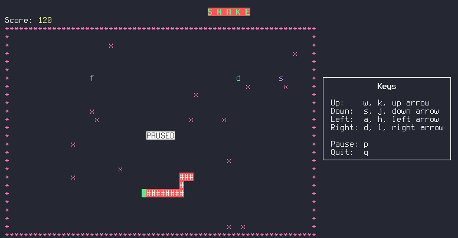

# Snake Curses



This is a basic Snake game in C with Ncurses. Raise the score eating food without hitting the wall, obstacles or yourself. You can also play with another person in two-players mode.
These are the items you will find in the map:

- **x**: Obstacle. As with the borders, your snake dies if you hit them
- **f**: Food. It will increase by one your size and give you points
- **d**: Decelerator. As you go eating food, your base speed will start increasing, eat these ones to get back to the starting speed. Beware that they will disappear if you don't take them fast
- **s**: Shortener. Taking one of these will cut by half the size of the snake. Like the decelerators, also have a limited amount of time in the map
- **e**: Extra points. Gives a bonus of points, limited duration

You can customize some of the default settings with the command line arguments:
```
Usage: snake [OPTIONS]

Snake Curses game

Players:
	-2, --two-players                      Enable two players mode

Size:
	-t, --use-terminal-dimensions          Map dimensions following terminal size
OR:
	-H, --height <height>                  Set height of the map (Def: 26)
	-W, --width <width>                    Set width of the map (Def: 66)

Obstacles:
	-o, --obstacles <permill>              Set permill of obstacles in the map (Def: 10)

Delay:
	-s, --starting-delay <ms>              Set starting delay in milliseconds (Def: 300)
	-m, --minimum-delay <ms>               Set minumum delay in milliseconds (Def: 120)
	-S, --step-delay <ms>                  Set reduction of delay in milliseconds when eating food (Def: 10)

Temporal items duration:
	-d, --duration-decelerator <s>         Set duration of decelerators in seconds (Def: 7)
	-D, --duration-shortener <s>           Set duration of shorteners in seconds (Def: 5)
	-e, --duration-extra-points <s>        Set duration of extra points in seconds (Def: 5)

Probability of items (1/X chances of appearing when eating a food):
	-p, --probability-decelerator <prob>   Set probability of decelerators (Def: 10)
	-P, --probability-shortener <prob>     Set probability of shorteners (Def: 15)
	-E, --probability-extra-points <prob>  Set probability of extra points (Def: 10)

Map change:
	-c, --score-step-map-change <score>    Set the step of score between map changes (Def: 200)
	-C, --disable-map-change               Disable map changing

	-h, --help                             Display this help
```

### AUR
If you use ArchLinux or a derivative, you can install the program from the AUR: [snake-curses](https://aur.archlinux.org/packages/snake-curses)

### Gentoo
1. Copy `distro-packages/gentoo/games-misc/` to [your local repository](https://wiki.gentoo.org/wiki/Handbook:AMD64/Portage/CustomTree#Defining_a_custom_repository)
2. Add the testing or live keywords to `package.accept_keywords`in Portage configuration if necessary
3. Run `emerge -av snake-curses`

### Manual build

#### Dependencies
- Make
- GCC/Clang
- Ncurses

#### Build
Build with `make`. That will leave you the `snake` executable.

#### Installation
You can directly run the compiled executable, but if you want to install it
on your system, `make install` will do it. Notice that you can set the
variable `PREFIX` (default to /usr/local) to your desire.

#### Uninstall
`make uninstall` (Mind the `PREFIX` too)
